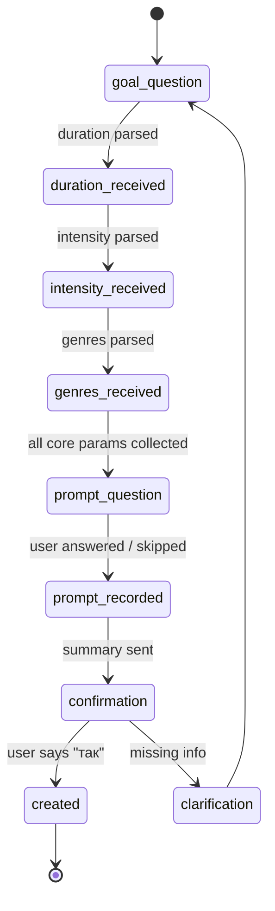
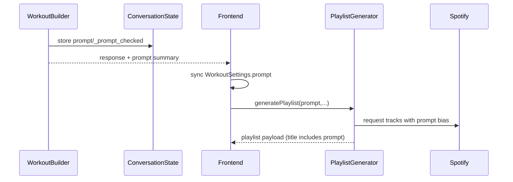

<!-- markdownlint-disable MD026 MD040 -->

# AI Conversation Architecture — Детальна документація

> **Версія**: 2.1 | **Дата**: 19 листопада 2025 | **Статус**: ✅ Production Ready

Цей документ описує внутрішню архітектуру AI-driven діалогової системи RunBeat, яка використовує LangChain multi-agent підхід для природного збору параметрів workout через розмову.

**Пов'язані документи**:

- [Architecture Report](./ARCHITECTURE_REPORT.md) — високорівневий огляд системи, backend layers, схеми потоків даних
- [Root README](../README.md) — швидкий старт, команди запуску, тестування

---

## 📚 Огляд системи

RunBeat використовує мультиагентну LangChain архітектуру з двома ключовими агентами:

- **SupervisorAgent** — оркестратор розмови, керує станом (`ConversationState`)
- **WorkoutBuilder** — AI-асистент, що веде діалог та збирає параметри workout

---

## 🔄 Що нового у v2.1

| Напрямок           | Опис                                                                                                                                                                                                   |
| ------------------ | ------------------------------------------------------------------------------------------------------------------------------------------------------------------------------------------------------ |
| Автологування      | Кожен виклик `WorkoutBuilder` логує вхідне повідомлення, зібрані параметри, усі tool-calls та статус (`needs_clarification`, `is_complete`).                                                           |
| Автопарсинг        | Навіть якщо LLM не викликає `extract_workout_parameters`, інструмент проганяється автоматично на кожне повідомлення.                                                                                   |
| Валідація          | Тривалість/інтенсивність нормалізуються й перевіряються. Відхилені значення не блокують розмову.                                                                                                       |
| Supervisor         | `ConversationUpdate` повертає `created_workout`, `needs_clarification`, `is_complete`. Supervisor очищає state лише після реального завершення.                                                        |
| API/Frontend       | `/chat/message` прокидає нові прапорці; UI більше не показує «Потрібна додаткова інформація», а рендерить акуратні бейджі.                                                                             |
| Music prompt stage | Після збору основних даних агент питає необов’язкові музичні побажання (атмосфера, деталізація жанрів, виконавці, стиль), зберігає їх у `prompt` і використовує як підказку для пошуку треків/Spotify. |
| Деплой             | Web застосунок збирається через `nixpacks.toml` без кастомного Dockerfile, що усуває `EBUSY` під час build.                                                                                            |

---

## 🏗️ Архітектура

### Компоненти системи:

```mermaid
flowchart TD
    U(User Input) --> SA[SupervisorAgent<br/>OPENAI_MODEL_SUPERVISOR]
    SA --> WB[WorkoutBuilder<br/>OPENAI_MODEL_CONVERSATION]
    WB --> T1[extract_workout_parameters]
    WB --> T2[create_workout_from_params]
    SA --> CS[ConversationService (Supabase)]
    T2 --> DB[(workouts table)]
    WB -->|ConversationUpdate| SA
    SA -->|ChatResponse| UI[Frontend Chat]
```

---

## 📦 Структура файлів

```
apps/backend/app/
├── agents/
│   ├── base.py                          # BaseAgent (існує)
│   ├── supervisor.py                    # SupervisorAgent
│   ├── prompts/
│   │   └── conversation_prompts.py      # CONVERSATION_AGENT_SYSTEM_PROMPT
│   └── tools/
│       ├── workout_tools.py             # create_workout_from_params
│       └── parameter_extraction_tools.py # extract_workout_parameters (НОВИЙ)
├── services/
│   ├── workout_builder.py               # WorkoutBuilder (оптимізований)
│   └── conversation_service.py          # Збереження в БД
├── schemas/
│   └── conversation.py                  # ConversationState, ConversationUpdate
└── api/routes/
    └── chat.py                          # /chat/message endpoint
```

---

## 🔧 Ключові компоненти

### 1. SupervisorAgent

**Файл**: `apps/backend/app/agents/supervisor.py`

**Відповідальність**:

- Зберігає `ConversationState` між повідомленнями
- Делегує увесь діалог `WorkoutBuilder`
- Логує стан після кожного turn’у (`last_question`, `collected_parameters`, `created_workout`)
- Працює з `ConversationUpdate`:
  - якщо `created_workout` або `is_complete=true` — маркує розмову як завершену й очищає state
  - якщо користувач підтвердив, але агент не створив воркаут, викликає `_create_workout_from_params_internal`
- Зберігає історію розмови в Supabase (`conversation_service`)

**Методи**:

- `handle_message(user_id, message)` — головний entry point, повертає `ConversationUpdate`
- `_get_or_create_state(user_id)` — ініціалізує стан
- `clear_state(user_id)` — очищує state після успішного завершення або відмови

---

### 2. WorkoutBuilder



**Файл**: `apps/backend/app/services/workout_builder.py`

**Відповідальність**:

- Веде природний діалог і формує контекст
- Викликає LangChain tools та дублює `extract_workout_parameters` автоматично, щоб завжди мати свіжі параметри
- Нормалізує/валідує дані (5–180 хв, intensity ∈ {low, moderate, high}, жанри → англійські назви)
- Логує кожний turn: повідомлення, параметри, tool-calls, статус (`needs_clarification`, `is_complete`)
- Повертає `ConversationUpdate` з `created_workout`, `needs_clarification`, `is_complete`
- Зберігає необов’язковий `prompt` — короткий опис музичного запиту (атмосфера, додаткові жанри, виконавці, стилі), який використовується виключно для підбору треків/Spotify

**Ключові зміни (v2.1)**:

- ✅ Автовиклик `extract_workout_parameters` та злиття параметрів у state
- ✅ Нормалізація й чіткі повідомлення, якщо тривалість/intensity некоректні
- ✅ `return_intermediate_steps=true` + розбір tool-результатів
- ✅ Нові логи `[Conversation] ...`
- ✅ Темп 0.8, `max_iterations=5`, таймаут 20 s

**Методи**:

- `process_message(state, user_message)` — обробка повідомлення
- `_auto_extract_parameters(...)` — внутрішній автозапуск tool
- `_process_tool_steps(...)` — обробка `intermediate_steps`
- `_build_conversation_context(state, user_message)` — побудова контексту
- `_get_fallback_response(...)` + `_format_missing_prompt(...)` — дружні підказки, без повторення шаблону
- `_determine_question_type_from_response(...)` — визначення типу питання

---

### 3. extract_workout_parameters Tool

**Файл**: `apps/backend/app/agents/tools/parameter_extraction_tools.py`

**Призначення**: AI-driven витягування параметрів з контексту розмови

**Параметри**:

- `user_message` — поточне повідомлення користувача
- `conversation_history` — JSON історії розмови
- `current_params` — JSON поточних параметрів

**Повертає**:

```json
{
  "duration_minutes": int | null,
  "intensity": "low" | "moderate" | "high" | null,
  "workout_type": "steady" | "intervals" | "fartlek" | null,
  "genres": ["genre1", "genre2"],
  "all_collected": boolean
}
```

**Особливості**:

- ✅ Параметри **акумулюються** (не перезаписуються)
- ✅ Genres **нормалізуються** до англійських назв
- ✅ Підтримка української та англійської мов
- ✅ Robust error handling

---

### 4. CONVERSATION_AGENT_SYSTEM_PROMPT

**Файл**: `apps/backend/app/agents/prompts/conversation_prompts.py`

**Особливості**:

- 📝 Промпт на **англійській мові** (для кращої роботи GPT)
- 🇺🇦 Агент відповідає **українською**
- 🧠 Чіткі інструкції для **context awareness**
- 📚 Приклади діалогів (включно з проблемним сценарієм)
- 🚫 Правила для уникнення loops

**Структура**:

1. ROLE & PERSONALITY
2. MISSION & GOALS
3. CRITICAL: CONTEXT AWARENESS
4. TOOLS USAGE
5. CONVERSATION FLOW
6. PARAMETER RECOGNITION GUIDE
7. EXAMPLES OF GOOD CONVERSATION
8. CRITICAL RULES TO AVOID LOOPS
9. LANGUAGE & TONE

---

## 🔌 Контракт Backend ↔ Frontend

- **ConversationUpdate** (backend внутрішній клас):
  - `response_message: str`
  - `created_workout: dict | None`
  - `needs_clarification: bool`
  - `is_complete: bool`
- **ChatResponse** (`apps/backend/app/schemas/chat.py`):
  - `message`
  - `workout` (Pydantic `Workout`, якщо `created_workout` валідний, включно з `prompt`, який описує музичні побажання: атмосферу, додаткові жанри, улюблених виконавців)
  - `needs_clarification`
  - `is_complete`
  - `conversation_id` (для майбутнього трекінгу)
- **Frontend**:
  - `useChat.sendMessage` повертає `SendMessageResult` з тими ж прапорцями.
  - `MessageBubble` читає `_metadata` й показує акуратний бейдж «Ще уточнюємо деталі» замість старого тексту.
  - `ChatPage` активує CTA для генерації плейлиста тільки коли `is_complete=true` та автоматично синхронізує `workout.prompt` з `WorkoutSettings.prompt`.

---

## 🎵 Music Prompt / Atmosphere Flow



1. **Збір у чаті**: WorkoutBuilder після жанрів ставить одне уточнююче питання про музичні побажання (атмосфера/жанри/виконавці). Відповідь зберігається в `ConversationState.collected_parameters.prompt`. Якщо побажань немає — поле очищується, а `_prompt_checked` стає `true`.
2. **Створення воркауту**: Supervisor та `create_workout_from_params` передають `prompt` у таблицю `workouts`. Усі API-відповіді (`ChatResponse`, `GET /workouts/:id`, історія плейлистів) повертають цю строку.
3. **Frontend**: `ChatPage` підтягує `workout.prompt`, підставляє його в `WorkoutSettings.prompt`, показує в UI та відправляє до бекенда при генерації плейлистів або варіантів.
4. **Генератор плейлистів**: `PlaylistGenerator` інтерпретує `prompt` як музичну підказку (атмосферу/артистів/стиль), робить жанрову евристику й зміщує `target_energy`/seed genres під опис користувача. Це впливає лише на підбір треків, не на workout-логіку.
5. **Документація**: у цій схемі `prompt` — чисто музичний сигнал, тому він відображається у відповіді як опис атмосфери, щоб користувач бачив, що саме буде використано під час генерації треків.

---

## 🔄 Conversation Flow

### Типовий діалог:

```
1. User: "інтервальна"
   → Автовиклик `extract_workout_parameters` → `workout_type=intervals`
   → AI: «Супер! Скільки хвилин і яка інтенсивність?»

2. User: "355 хвилин" (помилкове значення)
   → Авто-парсер повертає `_duration_invalid`
   → AI: «Тривалість має бути 5–180 хв. Вкажи реальний час?»

3. User: "44 хвилини"
   → `duration_minutes=44`
   → AI: «Прийнято. Яку інтенсивність хочеш?»

4. User: "середня"
   → `intensity=moderate`
   → AI: «Чудово. Яку музику ставимо?»

5. User: "рок"
   → `genres=['rock']`, `all_collected=true`
   → AI: «🎶 Маємо середню пробіжку на 44 хв під rock. Маєш ще побажання до атмосфери?»

6. User: "нічний вайб, трохи синтвейву"
   → `prompt="нічний вайб, трохи синтвейву"`, `_prompt_checked=true`
   → AI: «Супер! 44 хв, середня інтенсивність, рок + нічний вайб. Створюємо воркаут?»

7. User: "так"
   → AI викликає `create_workout_from_params` → `created_workout`
   → У чаті: «✅ Воркаут успішно створено! Тепер можна згенерувати плейлист.»
   → Supervisor очищає state, зберігає історію як completed. `prompt` переходить у плейлист-генератор як музична підказка (атмосфера/жанри/виконавці).
```

---

## 🧪 Тестування

### Unit тести (29):

- `test_parameter_extraction_tools.py`
  - Витягування duration (3 тести)
  - Витягування intensity (3 тести)
  - Витягування workout type (3 тести)
  - Витягування genres (3 тести)
  - Merge parameters (6 тестів)
  - Check all collected (5 тестів)
  - Tool integration (4 тести)

### Integration тести (12):

- `test_workout_builder_integration.py`
  - Проблемний сценарій (1 тест)
  - All info at once (1 тест)
  - Context building (1 тест)
  - Fallback responses (4 тести)
  - Question type determination (3 тести)
  - Error handling (1 тест)
  - History management (1 тест)

**Загальне покриття**: 41 тест ✅

---

## 🚀 Deployment

### Environment Variables:

```bash
# OpenAI API
OPENAI_API_KEY=sk-...

# Models (optional, defaults to OPENAI_MODEL)
OPENAI_MODEL=gpt-4
OPENAI_MODEL_CONVERSATION=gpt-4-turbo  # Для природного діалогу
OPENAI_MODEL_SUPERVISOR=gpt-3.5-turbo  # Для оркестрації
OPENAI_MODEL_PARSER=gpt-3.5-turbo      # Для tools

# LangChain (optional)
USE_LANGCHAIN_SUPERVISOR=true
USE_LANGCHAIN_PARSER=true
```

### Запуск:

### Backend

- Запуск: `uvicorn app.main:app --reload --port 8000`
- Production: `uvicorn app.main:app --host 0.0.0.0 --port $PORT`
- Railway: `apps/backend/railway.json` (Nixpacks)

### Frontend (Web)

- Build: `npm run build`
- Serve: `npx serve -s dist -l $PORT`
- Railway:
  - `apps/web/nixpacks.toml` (вказує Node 20, `npm ci`, `npm run build`)
  - `apps/web/railway.json` → `"builder": "NIXPACKS"`
  - Dockerfile не використовується → немає конфлікту `/app/node_modules/.cache`

---

## 📊 Метрики та моніторинг

### Ключові метрики:

1. **Conversation completion rate** — % діалогів що завершилися створенням workout
2. **Average messages per conversation** — середня кількість повідомлень
3. **Parameter extraction accuracy** — точність витягування параметрів
4. **Response time** — час відповіді агента

### Логування:

```python
# Всі важливі події логуються через loguru
logger.info(f"[Conversation] user={state.user_id} -> '{user_message}' (collected={...})")
logger.info(f"[Conversation] user={state.user_id} <- '{response}' (needs={...}, complete={...})")
logger.debug(f"Parameter extraction: extracted={extracted}, merged={merged}")
logger.error(f"Error in WorkoutBuilder.process_message: {e}")
```

---

## 🐛 Troubleshooting

### Проблема: Агент повторює питання

**Причина**: Параметри не витягуються або не зберігаються

**Рішення**:

1. Перевірити що `extract_workout_parameters` викликається
2. Перевірити що `collected_parameters` оновлюються
3. Перевірити логи: `logger.debug(f"Updated collected_parameters: {collected}")`

### Проблема: Агент не створює workout

**Причина**: Не всі параметри зібрані або user не підтвердив

**Рішення**:

1. Перевірити `all_collected` в response від `extract_workout_parameters`
2. Перевірити що user сказав "так"/"yes"/"ok"
3. Перевірити `state.last_question == "final_confirmation"`

### Проблема: 500 Error в API

**Причина**: Workout model validation error

**Рішення**:

1. Перевірити що `created_workout` має всі required поля
2. Додати валідацію перед створенням `Workout(**created_workout)`
3. Перевірити логи backend

---

## 🔮 Майбутні покращення

### Phase 1 (Short-term):

- [ ] Streaming responses для швидшої відповіді
- [ ] Персоналізація на основі user patterns
- [ ] A/B тестування різних промптів

### Phase 2 (Mid-term):

- [ ] Мультимовність (English, Polish, etc.)
- [ ] Голосовий ввід (speech-to-text)
- [ ] Рекомендації на основі історії

### Phase 3 (Long-term):

- [ ] Adaptive learning (покращення на основі feedback)
- [ ] Інтеграція з wearables (Garmin, Apple Watch)
- [ ] Predictive workout suggestions

---

## 📚 Додаткові ресурси

- **[Architecture Report](./ARCHITECTURE_REPORT.md)** — високорівневий огляд стеку, backend layers, mermaid-діаграми
- **[Root README](../README.md)** — швидкий старт, команди для локального запуску та деплою
- **[Backend Tests](../apps/backend/tests/)** — unit та integration тести для агентів, tools, API endpoints
- **[Backend ENV Setup](../apps/backend/ENV_SETUP_GUIDE.md)** — налаштування змінних середовища

---

> **Версія документації**: 2.1
> **Останнє оновлення**: 19 листопада 2025
> **Автор**: RunBeat Team
